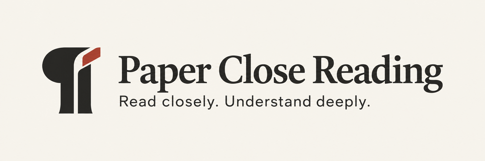
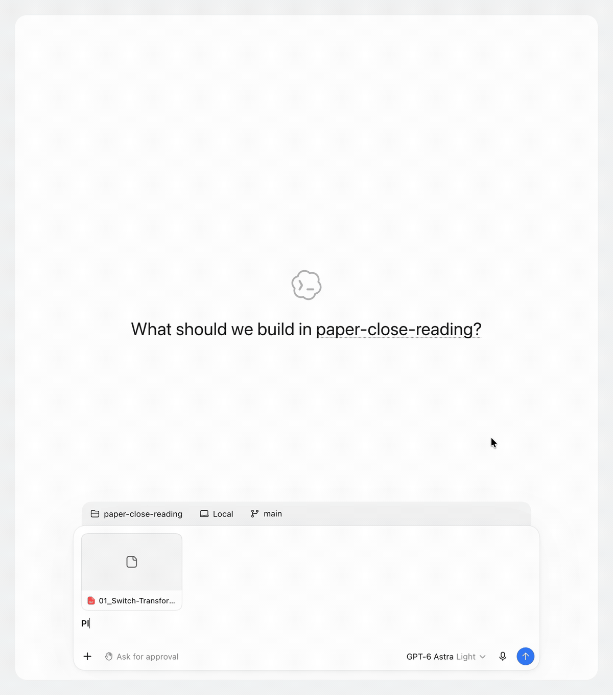
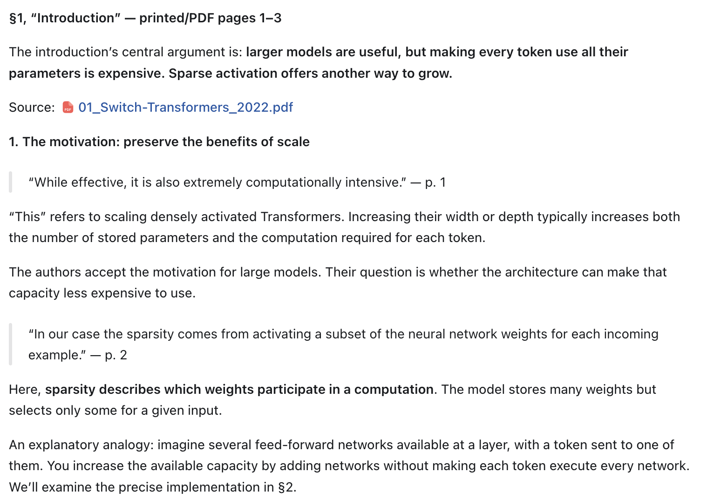
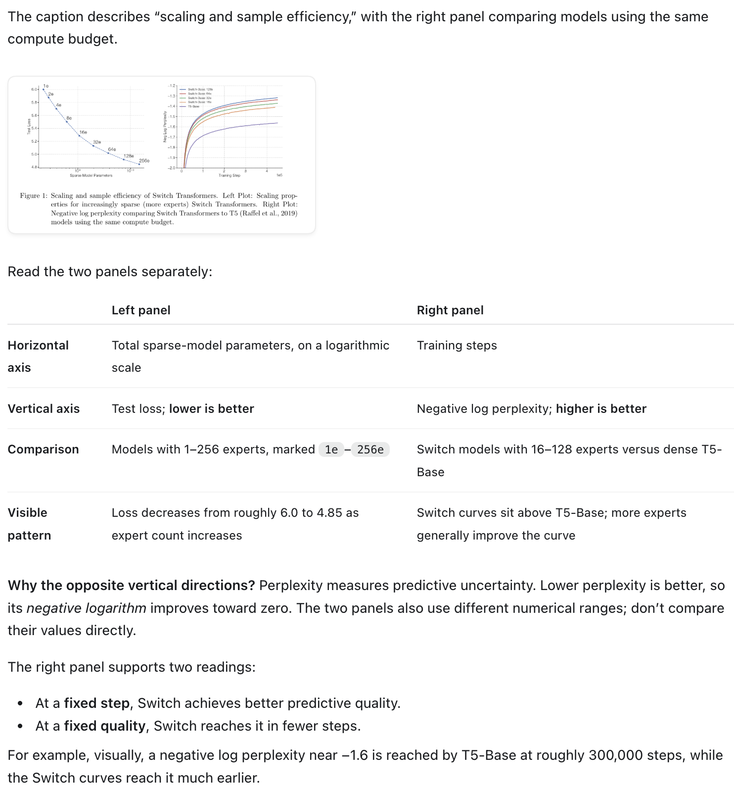
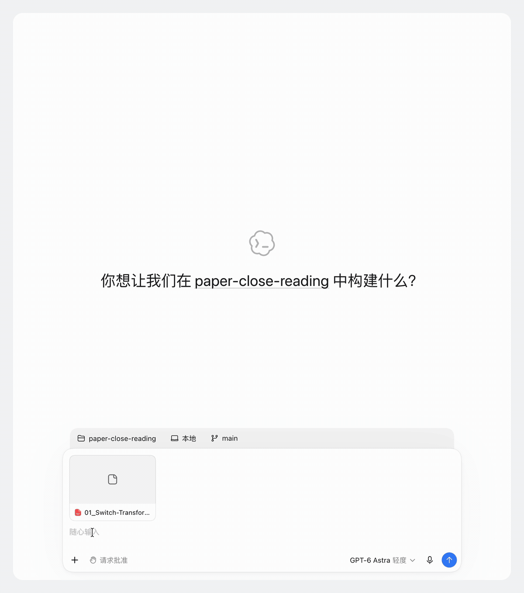
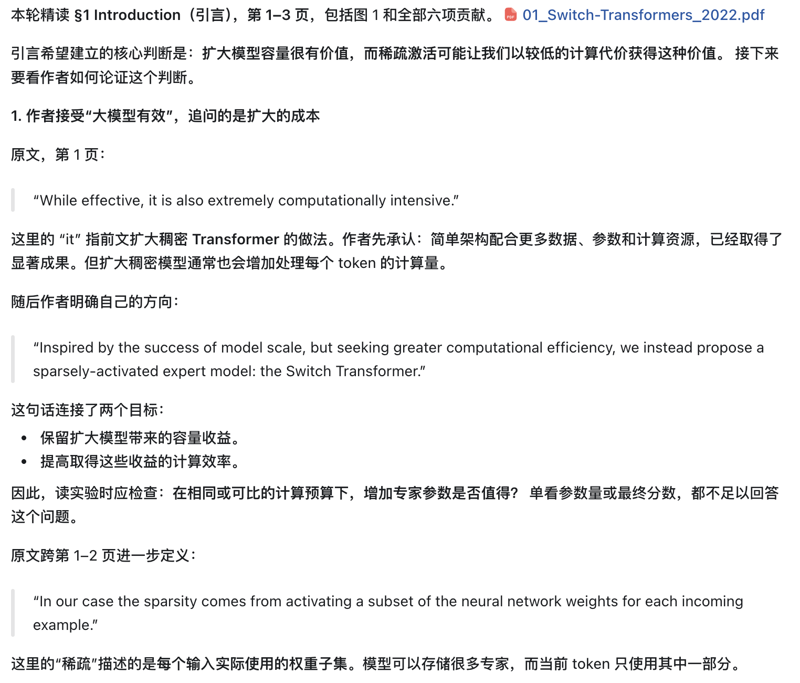
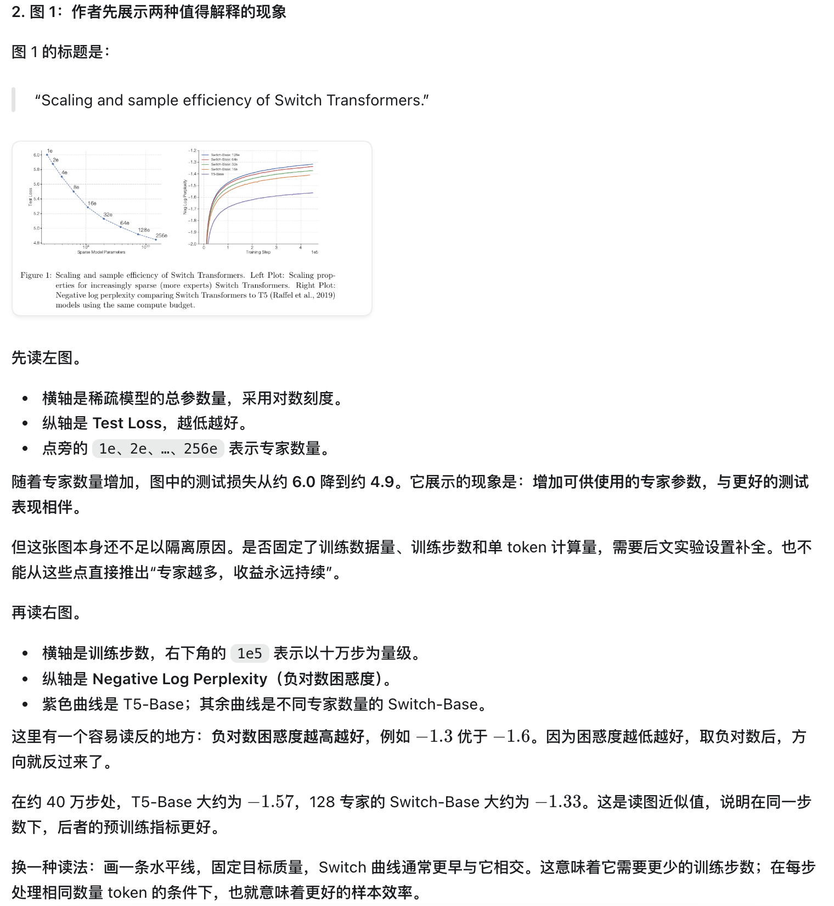
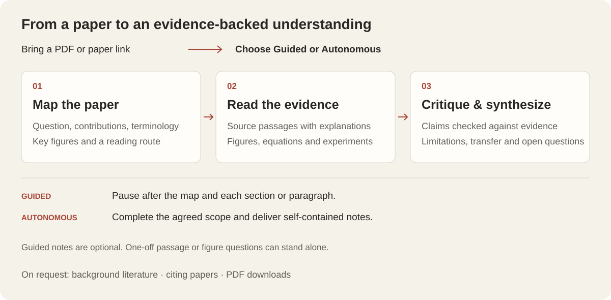

<p align="center">
  
</p>

<p align="center">
  <strong>English</strong> · <a href="README.zh-CN.md">简体中文</a>
</p>

Read academic papers with an agent that keeps the original text, its explanation, and the supporting evidence together. **Paper Close Reading** is an Agent Skill for interactive learning or autonomous analysis, from a first-pass paper map to figures, experiments, and a critical synthesis.

Bring a paper. Choose how you want to read. Ask questions as you go.

> **New in v1.5🎉 · Paper discovery and close-reading improvements**
>
> - Structured Google Scholar paper lookup and citation counts.
> - On-request PDF downloads with file validation and separate identity/version checks.
> - Richer paper maps with main authors, institutions, and source information.
> - Improved guidance for sandbox networking and existing proxy configurations.
> - Bilingual documentation and real close-reading demos.
>
> [View the changelog](CHANGELOG.md#v15--2026-09-17)

## Contents

- [Quick start](#quick-start)
- [Demo](#see-it-in-action)
- [Reading workflow](#how-reading-works)
- [More ways to use it](#more-ways-to-use-it)
- [Paper lookup and downloads](#paper-lookup-and-downloads)
- [Requirements](#requirements)
- [Reading notes](#reading-notes)
- [Project files](#project-files)
- [License and support](#license-and-support)

## Quick start

### 1. Install the skill

With Node.js/npm and Git available, run:

```sh
npx skills add Delores-Lin/paper-close-reading --skill paper-close-reading --global --copy
```

This uses the third-party [Skills CLI](https://github.com/vercel-labs/skills) to install the skill from this GitHub repository. `npx` runs the installer; there is no separate Paper Close Reading npm package. Follow the installer prompts to select your target agent. Omit `--global` to install only in the current project.

<details>
<summary>Install from a local checkout, or without npx</summary>

From the repository root, install the files in that checkout:

```sh
npx skills add . --skill paper-close-reading --global --copy
```

Without Node/npm, copy the entire `skills/paper-close-reading/` directory into the skills directory used by your target agent. Include its `references/`, `scripts/`, and `agents/` folders. Check for an existing installation before replacing it.

</details>

### 2. Attach a paper and choose a mode

In a new conversation, attach a PDF or provide an accessible paper link. For an interactive reading:

```text
Use the paper-close-reading skill in Guided mode to walk me through this paper.
Start with the paper map and pause. Then read one complete section at a time.
Please respond in English.
```

For an independent analysis:

```text
Use the paper-close-reading skill in Autonomous mode to read this paper.
Complete all three passes and save self-contained notes with source locations,
figures, limitations, and open questions.
```

The skill asks which mode you want if you have not specified one. A question about a single passage or figure can be answered directly.

### 3. Continue at your pace

In Guided mode, “continue” advances one reading unit. Ask a follow-up whenever needed, or switch explicitly to paragraph-level reading. To save notes along the way, say: **“Keep reading notes as we go.”**

## See it in action

**Switch Transformers: from a PDF to a reading map.** This real session introduces the paper, maps its argument, and prepares the next reading step. Waiting and scrolling are accelerated; no explanatory overlays have been added.

<p align="center">
  
</p>

### Read the source and its explanation together

See what a passage says, where it appears, and how it fits the argument. The example below explains why sparse activation separates model capacity from the computation used for each input.



### Inspect the evidence behind the claim

Figure reading covers axes, comparisons, metric direction, and the conclusions the visual can support. This excerpt compares the two panels of Figure 1 rather than reducing them to “performance improves.”

<details open>
<summary>Figure 1: scaling and sample efficiency</summary>



</details>

<details>
<summary>查看中文版演示与精读截图 / Chinese examples</summary>







</details>

These are **reading-process excerpts**, not a claim that the whole paper has been read. Citation counts visible in recordings are historical observations, not current values. Paper: William Fedus, Barret Zoph, and Noam Shazeer, [Switch Transformers](https://jmlr.org/papers/v23/21-0998.html), JMLR 23 (2022). The paper and reproduced figure retain their original attribution and license.

## How reading works



| Pass | What you get |
| --- | --- |
| **1 · Map** | Paper identity and reading version; main authors and institutions; research question, contributions, terminology, key visuals, and a reading route. |
| **2 · Read** | Located source passages with explanations, methods and experiments broken down, and cited figures, tables, equations, and appendices examined in context. |
| **3 · Synthesize** | A claim–evidence assessment, limitations, unresolved questions, and implications for your research. |

| | Guided | Autonomous |
| --- | --- | --- |
| Pace | One section or one paragraph per turn | Complete the agreed scope without routine pauses |
| After the map | Pause for you | Continue with the agreed analysis |
| Before final synthesis | Ask before entering Pass 3 | Proceed within the requested scope |
| Notes | Save only when requested | Deliver self-contained notes |
| Best for | Learning, discussion, and checking your understanding | Independent analysis and reusable research outputs |

The three passes also support a quick map-only triage or a deeper replication-oriented reading. Source claims, interpretations, and critique are kept distinct. Figure explanations return to the actual visual evidence; a caption alone is not treated as proof.

## More ways to use it

| Goal | Example prompt |
| --- | --- |
| Read line by line | “Use Guided mode and paragraph-level reading. Explain each sentence and inspect every figure it cites.” |
| Understand a figure | “Explain Figure 3: axes, comparisons, metric direction, and what it does and does not establish.” |
| Prepare a replication | “Use Autonomous mode for a replication-oriented reading. Include appendices, hyperparameters, evaluation details, and missing information.” |
| Explore applicability | “Explain which assumptions would need to hold to use this method for my task: …” |
| Check metadata | “Find this paper’s reading version and Google Scholar citation count. Include the source and lookup time.” |
| Investigate prior work | “Find and explain the method this paper builds on.” |
| Explore later research | “Find later papers citing this work and verify how they extend or challenge it.” |

Prior-work exploration and citing-paper searches run **only when requested**. The default reading map is built from the paper itself, without traversing its entire reference list.

## Paper lookup and downloads

The bundled Scholar helper retrieves structured paper candidates, source links, and citation labels. It checks local Node capabilities, uses native `fetch` when supported, and tries curl when Node is missing or incompatible with the configured proxy. The Python entry point handles requests, decoding, and structured output.

- A returned candidate is **not yet a verified paper match**. Title, authors, year, and available identifiers must be checked; the first result is not selected automatically.
- Citation counts keep their source and acquisition time. Missing counts stay unknown and do not block reading.
- Persistent lookup caching is opt-in. Cached results retain their original query time.
- Full-text downloads are requested explicitly, or as part of requested local reading. The helper validates the file; paper identity and reading version still require verification.
- Later citing papers can be explored on request; exhaustive citation coverage is not guaranteed.

<details>
<summary>Run the helpers directly</summary>

From the skill directory:

```sh
python3 scripts/scholar_lookup.py --title "Switch Transformers"
```

Opt in to a local cache, or refresh a previous lookup:

```sh
python3 scripts/scholar_lookup.py --title "Switch Transformers" --cache-dir ./scholar-cache
python3 scripts/scholar_lookup.py --title "Switch Transformers" --cache-dir ./scholar-cache --refresh
```

After selecting and verifying a candidate, download its observed HTTPS full-text URL:

```sh
python3 scripts/scholar_download.py --url "<verified-https-full-text-url>" --output ./paper.pdf
```

For response fields, proxy behavior, and validation boundaries, see the [Scholar lookup reference](skills/paper-close-reading/references/google-scholar-json.md).

</details>

## Requirements

| Capability | Requirement |
| --- | --- |
| Core reading | An agent that can load skill instructions, access the paper, inspect figures, and save notes using suitable file/PDF tools |
| Illustrated evidence | A PDF renderer/extractor, such as Poppler (`pdftotext`, `pdftoppm`, `pdfinfo`), or equivalent host tools |
| CLI installation | Node.js/npm and Git for the Skills CLI; manual copying does not require npm |
| Scholar helper scripts | Python 3 standard library, plus supported Node native `fetch` or curl |
| External metadata and downloads | Permission to execute the helper scripts and access the network |

This repository also includes optional Codex plugin packaging. The installation command above installs the skill itself.

**Network recovery.** In a known network-restricted sandbox, the skill asks for host-authorized execution outside the sandbox. For connection errors or a suspicious 404, it checks the URL and existing proxy configuration. It stops automated requests on 403, 429, or CAPTCHA. The Scholar endpoint is undocumented and may change; neither service availability nor a fixed response time is guaranteed.

## Reading notes

Autonomous reading produces notes. Guided reading saves them only when you ask. Notes and their visual evidence stay together:

```text
notes/<paper-name>/
├── close-reading.md
└── images/
    ├── figure_01_<description>.png
    └── table_01_<description>.png
```

The [note template](skills/paper-close-reading/references/note-template.md) covers the research question, terminology, methods, evidence, conclusions, limitations, and reusable research ideas. Figure paths are relative so the note directory can be moved as a unit.

## Project files

```text
skills/paper-close-reading/
├── SKILL.md                 # Reading modes and evidence rules
├── agents/                 # Host metadata
├── references/             # Reading, note, and Scholar workflows
└── scripts/                # Lookup, fetch, and PDF download helpers
assets/
├── branding/               # Header and standalone mark
├── diagrams/               # English and Chinese reading flows
├── demos/                  # Real screen recordings, edited for display
└── screenshots/            # Unaltered close-reading excerpts
.codex-plugin/plugin.json   # Codex plugin packaging
```

Developer fixtures, unit tests, and validation records are kept locally and excluded from Git. Installation does not require them. Optional plugin packaging details are in [SUBMISSION.md](SUBMISSION.md).

## License and support

Project code and instructions are [MIT licensed](LICENSE). Third-party paper excerpts and figures retain their respective rights and attribution. See [Privacy](PRIVACY.md), [Terms](TERMS.md), or [open an issue](https://github.com/Delores-Lin/paper-close-reading/issues).
