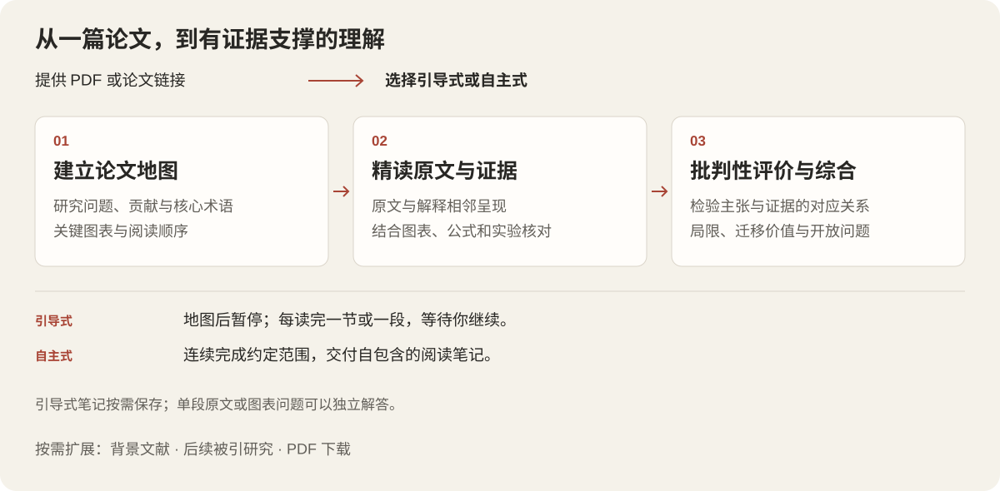

<p align="center">
  
</p>

<p align="center">
  <a href="README.md">English</a> · <strong>简体中文</strong>
</p>

让原文、解释和证据出现在一起。**Paper Close Reading** 是论文精读 Agent Skill，支持交互式引导与自主分析：先建立论文地图，再逐步理解方法、图表和实验，最后形成有证据依据的评价。

提供论文，选择阅读方式，在理解过程中随时追问。

> **v1.5 更新🎉 · 论文检索与精读体验升级**
>
> - 新增 Scholar 结构化论文检索与引用量查询。
> - 支持按需下载 PDF，分别校验文件有效性、论文身份和阅读版本。
> - 完善论文地图中的主要作者、机构及来源信息。
> - 改进沙箱网络与已有代理配置的处理说明。
> - 新增中英文文档及真实精读演示。
>
> [查看完整更新日志](CHANGELOG.md#v15--2026-09-17)

## 目录

- [快速开始](#快速开始)
- [真实精读演示](#真实精读演示)
- [阅读流程](#阅读流程)
- [更多用法](#更多用法)
- [论文检索与下载](#论文检索与下载)
- [使用要求](#使用要求)
- [阅读笔记](#阅读笔记)
- [项目结构](#项目结构)
- [许可与支持](#许可与支持)

## 快速开始

### 1. 安装 skill

准备好 Node.js/npm 和 Git，然后运行：

```sh
npx skills add Delores-Lin/paper-close-reading --skill paper-close-reading --global --copy
```

这条命令通过第三方 [Skills CLI](https://github.com/vercel-labs/skills) 从 GitHub 安装 skill。`npx` 用于运行安装工具，不需要另行发布或安装名为 Paper Close Reading 的 npm 包。按照安装工具提示选择目标 agent。去掉 `--global` 可仅安装到当前项目。

<details>
<summary>从本地工作副本安装，或不使用 npx</summary>

在仓库根目录运行，安装该工作副本中的文件：

```sh
npx skills add . --skill paper-close-reading --global --copy
```

没有 Node/npm 时，也可以将整个 `skills/paper-close-reading/` 目录复制到目标 agent 使用的 skills 目录。保留其中的 `references/`、`scripts/` 和 `agents/`。替换前先检查是否已有安装。

</details>

### 2. 提供论文并选择模式

在新对话中附加 PDF，或提供可访问的论文链接。希望边读边讨论时：

```text
请使用 paper-close-reading skill，采用引导式模式带我阅读这篇论文。
先建立论文地图并暂停，然后每轮精读一个完整小节。请用中文讲解。
```

希望独立完成分析时：

```text
请使用 paper-close-reading skill，采用自主式模式阅读这篇论文。
完成三遍阅读，保存包含原文位置、图表、局限和开放问题的完整阅读笔记。
```

没有明确模式时，skill 会先询问。只解释某段原文或某张图表，无需启动整篇阅读流程。

### 3. 按自己的节奏继续

引导式模式下，“继续”只推进一个阅读单元。你可以随时追问，也可以明确切换为逐段阅读。如果希望同步保存笔记，补充一句：**“请在阅读过程中同步记录笔记。”**

## 真实精读演示

**Switch Transformers：从 PDF 到论文地图。** 这段真实会话展示论文信息核对、论证结构梳理与下一步阅读准备。等待和滚动经过加速，画面没有添加说明字幕或角标。

<p align="center">
  
</p>

### 原文与解释相邻呈现

说明原文说了什么、位于哪里，以及它在论证中的作用。下面的片段解释了为什么稀疏激活能够区分模型容量与每个输入实际使用的计算量。


### 结合图表检验证据

图表解读覆盖坐标轴、比较对象、指标方向，以及图中证据能支持什么结论。下面的片段分别解释图 1 的左右子图，而不止于“性能提升”。

<details open>
<summary>图 1：扩展性与样本效率</summary>


</details>

<details>
<summary>View the English demo and reading excerpts / 查看英文示例</summary>


</details>

这些是**精读过程片段**，并不表示整篇论文已经完成精读。录屏中显示的引用量是当时的查询结果，不代表当前数值。案例论文：William Fedus、Barret Zoph、Noam Shazeer，[Switch Transformers](https://jmlr.org/papers/v23/21-0998.html)，JMLR 23（2022）。论文及引用图表保留原有署名和许可。

## 阅读流程



| 阶段 | 得到什么 |
| --- | --- |
| **第一遍 · 建立地图** | 论文身份与阅读版本、主要作者和机构、研究问题、贡献、术语、关键图表及阅读顺序。 |
| **第二遍 · 精读证据** | 带位置的原文与解释，方法和实验拆解，以及在上下文中检查的图表、公式和附录。 |
| **第三遍 · 评价与综合** | 主张与证据的对应关系、局限、未解决的问题，以及对你的研究的启发。 |

| | 引导式 | 自主式 |
| --- | --- | --- |
| 阅读节奏 | 每轮一个完整小节，或一个原文段落 | 连续完成约定范围，不在普通章节之间暂停 |
| 地图完成后 | 暂停，等待你继续 | 按约定继续分析 |
| 进入第三遍前 | 先征求确认 | 在请求范围内继续 |
| 笔记 | 明确要求后保存 | 交付自包含的阅读笔记 |
| 适合场景 | 学习、讨论、检查自己的理解 | 独立分析、形成可复用的研究成果 |

也可以只做第一遍快速判断相关性，或选择复现导向的深入阅读。作者主张、解释推断和批判性意见分开呈现；图表判断回到原图，不能仅凭图注接受实验结论。

## 更多用法

| 需求 | 示例提示词 |
| --- | --- |
| 逐段精读 | “使用引导式、逐段阅读。解释每句话，并检查这一段引用的所有图表。” |
| 理解图表 | “解释图 3 的坐标、比较对象、指标方向，以及它能和不能证明什么。” |
| 准备复现 | “使用自主式做复现导向的精读，覆盖附录、超参数、评测细节和缺失信息。” |
| 判断迁移价值 | “我的任务是……。把这个方法用于我的任务，需要满足哪些假设？” |
| 查询论文信息 | “核对这篇论文的阅读版本和 Google Scholar 引用量，注明来源及查询时间。” |
| 补充前置文献 | “找到这篇论文继承的方法，并解释它与当前工作的关系。” |
| 查找后续研究 | “查找引用这篇论文的后续工作，核对它们怎样改进或质疑原结论。” |

前置文献与后续被引查询**仅在用户提出相关需求时执行**。默认地图来自当前论文，不自动遍历整个参考文献表。

## 论文检索与下载

内置 Scholar 辅助脚本返回结构化论文候选、来源链接和引用量标签。它先检查本地 Node 能力，支持时使用原生 `fetch`；Node 缺失或不能兼容当前代理配置时尝试 curl。Python 入口统一负责请求、解码和结构化输出。

- 返回候选不等于论文已匹配：需要核对标题、作者、年份及可用标识，不默认取第一条。
- 引用量保留来源和获取时间；缺失时标为未知，不因此阻塞阅读。
- 持久化缓存需要显式启用，命中缓存时保留原查询时间。
- 明确请求下载或本地阅读后，才获取全文。文件校验与论文身份、版本核对是不同步骤。
- 可按需查找后续被引论文，不保证完整覆盖所有引用。

<details>
<summary>直接运行检索与下载脚本</summary>

在 skill 目录运行：

```sh
python3 scripts/scholar_lookup.py --title "Switch Transformers"
```

按需开启本地缓存，或刷新已有查询：

```sh
python3 scripts/scholar_lookup.py --title "Switch Transformers" --cache-dir ./scholar-cache
python3 scripts/scholar_lookup.py --title "Switch Transformers" --cache-dir ./scholar-cache --refresh
```

选定并核对候选后，传入其实际返回的 HTTPS 全文链接：

```sh
python3 scripts/scholar_download.py --url "<已核对的HTTPS全文链接>" --output ./paper.pdf
```

返回字段、代理行为和验证范围见 [Scholar 检索说明](skills/paper-close-reading/references/google-scholar-json.md)。

</details>

## 使用要求

| 能力 | 所需条件 |
| --- | --- |
| 核心精读 | 能够加载 skill 指令、访问论文、查看图表和保存笔记的 agent，以及相应文件/PDF 工具 |
| 展示图表证据 | Poppler 等 PDF 渲染与提取工具（`pdftotext`、`pdftoppm`、`pdfinfo`），或宿主提供的等效能力 |
| 命令行安装 | Skills CLI 需要 Node.js/npm 和 Git；手动复制不需要 npm |
| Scholar 辅助脚本 | Python 3 标准库，以及支持原生 `fetch` 的 Node 或 curl |
| 外部信息与下载 | 执行辅助脚本和访问网络的权限 |

仓库附带可选的 Codex 插件打包配置；上面的安装命令安装的是 skill 本身。

**网络恢复：** 已知沙箱限制联网时，通过宿主授权机制在沙箱外执行。连接失败或异常 404 时，核对 URL 并检查已有代理配置。遇到 403、429 或验证码时停止自动请求。Scholar 使用的端点未公开文档，可能变化，不保证持续可用或固定响应速度。

## 阅读笔记

自主式阅读交付笔记；引导式只有在你要求时保存。笔记和相关图表放在一起：

```text
notes/<论文名称>/
├── close-reading.md
└── images/
    ├── figure_01_<description>.png
    └── table_01_<description>.png
```

[笔记模板](skills/paper-close-reading/references/note-template.md)覆盖研究问题、术语、方法、证据、结论、局限和可复用的研究思路。图片使用相对路径，可以连同整个笔记目录一起移动。

## 项目结构

```text
skills/paper-close-reading/
├── SKILL.md                 # 阅读模式与证据要求
├── agents/                 # 宿主展示信息
├── references/             # 精读、笔记与 Scholar 流程
└── scripts/                # 检索、请求与 PDF 下载辅助脚本
assets/
├── branding/               # 标题图与独立 Logo
├── diagrams/               # 中英文阅读流程图
├── demos/                  # 真实录屏剪辑
└── screenshots/            # 未改写的精读截图
.codex-plugin/plugin.json   # Codex 插件打包信息
```

开发测试、测试样本与验证记录仅保留在本地，已排除在 Git 之外，安装使用不依赖它们。可选插件打包说明见 [SUBMISSION.md](SUBMISSION.md)。

## 许可与支持

项目代码和说明采用 [MIT 许可](LICENSE)。第三方论文摘录与图表保留各自权利及署名。另见[隐私说明](PRIVACY.md)、[使用条款](TERMS.md)，或[提交问题](https://github.com/Delores-Lin/paper-close-reading/issues)。
